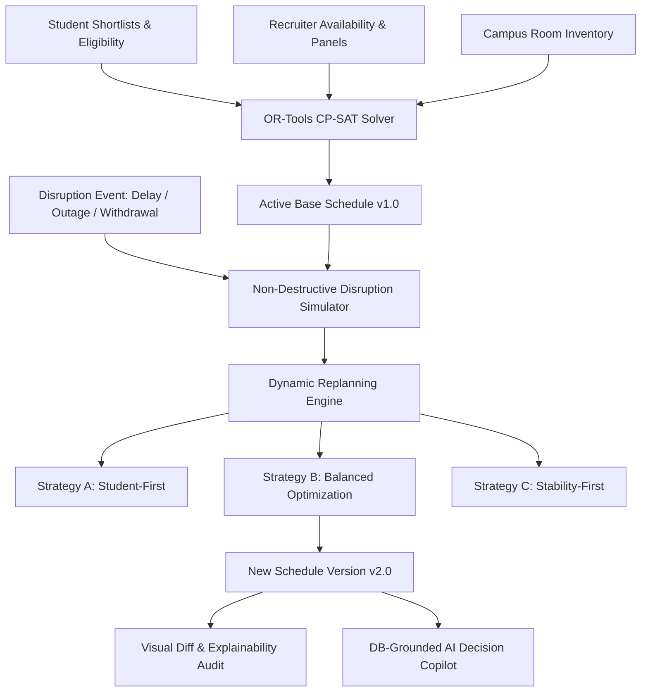

# Placement Control Tower: Comprehensive Architectural & Mathematical Specification

## 1. System Overview

The **AI-Assisted Placement Control Tower** is an enterprise-grade university placement week operations platform and dynamic replanning engine. Unlike basic CRUD timetabling applications or static dashboards, this system treats placement scheduling as a complex **Constrained Multi-Resource Allocation Problem (CMRAP)** and provides deterministic minimal-disruption replanning under operational disruptions.

---

## 2. Mathematical Formulation (Google OR-Tools CP-SAT)

### 2.1 Sets & Indices
- $\mathcal{S}$: Set of eligible students, $s \in \mathcal{S}$
- $\mathcal{C}$: Set of recruiting companies, $c \in \mathcal{C}$
- $\mathcal{P}_c$: Set of interview panels for company $c$, $p \in \mathcal{P}_c$
- $\mathcal{R}$: Set of physical interview rooms, $r \in \mathcal{R}$
- $\mathcal{T}$: Set of discrete 45-minute time slots (0 to 11 for Day 1), $t \in \mathcal{T}$

### 2.2 Decision Variables
$$x_{s, c, p, r, t} \in \{0, 1\}$$
where $x_{s, c, p, r, t} = 1$ if student $s$ is interviewed by company $c$ on panel $p$ in room $r$ at time slot $t$, and $0$ otherwise.

---

### 2.3 Hard Constraints

1. **Student Non-Overlap**: A student can attend at most one interview per time slot:
   $$\forall s \in \mathcal{S}, \forall t \in \mathcal{T}: \quad \sum_{c \in \mathcal{C}} \sum_{p \in \mathcal{P}_c} \sum_{r \in \mathcal{R}} x_{s, c, p, r, t} \le 1$$

2. **Panel Capacity**: A panel can conduct at most one interview per time slot:
   $$\forall c \in \mathcal{C}, \forall p \in \mathcal{P}_c, \forall t \in \mathcal{T}: \quad \sum_{s \in \mathcal{S}} \sum_{r \in \mathcal{R}} x_{s, c, p, r, t} \le 1$$

3. **Room Exclusivity**: A physical room can host at most one interview at any time slot:
   $$\forall r \in \mathcal{R}, \forall t \in \mathcal{T}: \quad \sum_{s \in \mathcal{S}} \sum_{c \in \mathcal{C}} \sum_{p \in \mathcal{P}_c} x_{s, c, p, r, t} \le 1$$

4. **Single Interview per Shortlist**: Each student is interviewed by a company at most once:
   $$\forall s \in \mathcal{S}, \forall c \in \mathcal{C}: \quad \sum_{p \in \mathcal{P}_c} \sum_{r \in \mathcal{R}} \sum_{t \in \mathcal{T}} x_{s, c, p, r, t} \le 1$$

5. **Company Operating Windows & Delays**: If company $c$ is delayed until slot $t_{start}(c)$, then for all $t < t_{start}(c)$:
   $$\sum_{s \in \mathcal{S}} \sum_{p \in \mathcal{P}_c} \sum_{r \in \mathcal{R}} x_{s, c, p, r, t} = 0$$

6. **Student Availability & Withdrawal**: If student $s$ has withdrawn from the drive, $x_{s, c, p, r, t} = 0$ for all assignments.

---

### 2.4 Multi-Objective Function (Scalarized Weighted Sum)

The CP-SAT solver optimizes a multi-objective goal balancing candidate fulfillment, tier prioritization, idle gap minimization, and churn prevention:

$$\max \quad Z = \sum_{s, c, p, r, t} x_{s, c, p, r, t} \cdot \left[ W_{tier}(c) + W_{time}(t) \right] - \sum_{s} W_{gap} \cdot \text{Gap}(s) + \sum_{s, c, p, r, t} W_{stab} \cdot \mathbf{1}_{\{ (s, c, p, r, t) = \text{base} \}}$$

Where:
- $W_{tier}(c) = 100 \times (4 - \text{Tier}(c))$ (Prioritizes Tier-1 companies)
- $W_{time}(t) = 20 - t$ (Encourages compact, earlier scheduling)
- $\text{Gap}(s) = \text{EndSlot}(s) - \text{StartSlot}(s) - \text{Count}(s)$ (Penalizes student idle wait between interviews)
- $W_{stab}$: Stability scalar (10,000 for Stability-First, 500 for Balanced, 0 for Initial solve)

---

## 3. Minimal-Disruption Replanning Strategy Matrix

| Dimension | Strategy A: Student-First | Strategy B: Balanced (Recommended) | Strategy C: Stability-First |
| :--- | :--- | :--- | :--- |
| **Stability Weight ($W_{stab}$)** | $50$ | $500$ | $10,000$ |
| **Waiting Time Penalty** | Heavy ($50$) | Moderate ($15$) | Low ($2$) |
| **Schedule Churn** | Higher ($15-25\%$ moved) | Minimal ($5-10\%$ moved) | Near Zero ($<3\%$ moved) |
| **Student Waiting Gaps** | Tightest possible | Optimized balance | May have larger gaps |
| **Primary Goal** | Minimize candidate fatigue | Maximum global welfare & stability | Strict schedule preservation |

---

## 4. AI Grounding & Zero-Hallucination Architecture

The AI Decision Copilot utilizes an enterprise **Database Grounding Pipeline**:

1. User sends operational inquiry (e.g., *"Why is TechNova a bottleneck?"*).
2. `AICopilotService` executes deterministic SQL queries to extract exact placement state:
   - Recruiter panel saturation %
   - Room occupancy density
   - Overlap conflicts count
   - Candidate shortlists count
3. The grounded context JSON is injected as an immutable system prompt into the **Groq `llama-3.3-70b-versatile` / `llama3-70b-8192`** provider.
4. The response citations match verified database entities (e.g. `Room R04`, `Panel P2`, `Student S0421`).
5. If Groq API key is absent, the system falls back seamlessly to deterministic rule-based explainability templates without throwing runtime errors.
